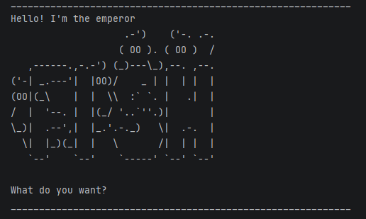

# Fish User Guide


> blub, blub...

This is Fish, with a capital F, your new personal planner. Treat him like a god and he will treat you like a dog. 


---

## Table of Contents

**Quick Start**
- [Installation](#installation)
- [Input format](#input-format)

**Adding Tasks** 
- [Adding a Todo](#adding-a-todo)
- [Adding a Deadline](#adding-a-deadline)
- [Adding an Event](#adding-an-event)

**Task Management**
- [Listing tasks](#listing-tasks)
- [Marking tasks](#marking-tasks)
- [Deleting tasks](#deleting-tasks)

**Task Searching**
- [Search by description](#search-by-description)
- [Filter deadlines](#filter-deadlines)

**General** 
- [Exiting](#exiting)
- [Saving the Data](#saving-the-data)
- [Editing the data file](#editing-the-data-file)

---

# Quick Start

## Installation

Ensure you have Java `17` or above installed in your computer. 
1. Download the latest `Fish.jar` file from [releases](https://github.com/natmloclam/ip/releases). 
2. Copy the file to the folder you want to use as the fish tank for Fish.
3. Open a command terminal, `cd` into the folder you put the jar file in, and use the `java -jar Fish.jar` command to run the application. Fish should introduce himself. 

You may now bow in his presence. 

## Input Format

All user inputs are parsed into commands and arguments. 

Commands
- Examples include `todo` and `list`
- Commands are **case-insensitive**
- An input of `lIsT` will still carry out the list operation
- Extra spaces between the command and argument are disregarded (need at least one)

Arguments 
- Examples include the description of tasks 
- Arguments are **case-sensitive**
- Task descriptions will appear as input by the user (includes letter casing and empty spaces)

---

# Adding Tasks

## Adding a Todo

Adds a simple task with a description. 

Format: `todo DESCRIPTION`\
Example: `todo borrow book`

Output:
```
    ____________________________________________________________
Lookin busy today
     1.[T][ ] borrow book
    You have 1 tasks. Get to work
    ____________________________________________________________
```

## Adding a Deadline

Adds a task with that needs to done by a specified date and time. Date should be 
input as `YYYY-MM-DD` and time should be input as `HH:mm` in 24-hour clock.

Format: `deadline DESCRIPTION /by DATE TIME`\
Example: `deadline submit ip /by 2026-3-6 23:59`

Output: 
```
    ____________________________________________________________
Lookin busy today
     2.[D][ ] submit ip (by: Mar 6 2026, 11:59pm)
    You have 2 tasks. Get to work
    ____________________________________________________________
```

## Adding an Event

Adds an event which has a description, a start and an end time. Timings need not be in any format.

Format: `event DESCRIPTION /from START /to END`\
Example: `event go for a swim /from 6pm /to 7pm`

Output: 
```
    ____________________________________________________________
Lookin busy today
     3.[E][ ] go for a swim (from: 6pm, to: 7pm)
    You have 3 tasks. Get to work
    ____________________________________________________________
```

---

# Task Management

## Listing Tasks

Shows everything in your task list. 

Format: `list`

Output: 
```
    ____________________________________________________________
Now get to work
     1. [T][ ] borrow book
     2. [D][ ] submit ip (by: Mar 6 2026, 11:59pm)
     3. [E][ ] go for a swim (from: 6pm, to: 7pm)
    ____________________________________________________________
```

## Marking Tasks

Mark a task as done. An `[X]` will show up next to the task. 

Format: `mark INDEX`

- The index refers to the index number shown in the task list
- Index must be a **positive integer** (1, 2, 3...)
- Index must be within the valid range of tasks

Example: `mark 2`

Output: 
```
    ____________________________________________________________
Not bad huh
     2.[D][X] submit ip (by: Mar 6 2026, 11:59pm)
    ____________________________________________________________
```

Or you can mark a task as incomplete. 

Format: `unmark INDEX`\
Example: `unmark 2`

Output: 
```
    ____________________________________________________________
Stop being a bum
     2.[D][ ] submit ip (by: Mar 6 2026, 11:59pm)
    ____________________________________________________________
```

## Deleting Tasks

Deletes a task from the list. 

Format: `delete INDEX`

> [!WARNING]
> Tasks that are deleted are **immediately removed** from the hard drive, and **cannot be retrieved**

Example: `delete 3`

Output: 
```
    ____________________________________________________________
Deleting your history hee hee
     3.[E][ ] go for a swim (from: 6pm, to: 7pm)
    You have 2 tasks. Get to work
    ____________________________________________________________
```

---

# Task Searching 

## Search by Description

Searches for tasks which contain a keyword in their description.

Format: `find KEYWORD`

- Keyword inputs are **case-sensitive**
- All tasks with descriptions containing the keyword will be shown 

Example: `find ip`

Output: 
```
    ____________________________________________________________
Here are the tasks that contain ip:
     1. [D][ ] submit ip (by: Mar 6 2026, 11:59pm)
    ____________________________________________________________
```

## Filter Deadlines

Filters all unmarked deadlines which are due before the input date. 
Date format should be `YYYY-MM-DD`, no time input needed. 

Format: `doby DATE`\
Example: `doby 2026-3-14`

Output:
```
    ____________________________________________________________
Here are the deadlines to be done by Mar 14 2026:
     1. [D][ ] submit ip (by: Mar 6 2026, 11:59pm)
    ____________________________________________________________
```

---

# General

## Exiting

Exits the program. 

Format: `bye`

Output: 
```
    ____________________________________________________________
    Goodbye land dweller
    ***swims away***
    ____________________________________________________________
```
## Saving the data

All tasks in the list are automatically saved in the hard drive after any command that changes the data.
No need to save manually.

## Editing the data file

All task data is stored as a text file in `[JAR file location]/data/fish.txt`. Users are advised not to 
make edits to this file directly.\
Data can be moved or copied just by moving or copying the `data/` folder to your new JAR file location.  

## Command Summary

| Action               | Format                                  |
|:---------------------|:----------------------------------------|
| **Add todo**         | `todo DESCRIPTION`                      |
| **Add deadline**     | `deadline DESCRIPTION /by DATE TIME`    |
| **Add event**        | `event DESCRIPTION /from START /to END` |
| **list**             | `list`                                  |
| **mark**             | `mark INDEX`                            |
| **unmark**           | `unmark INDEX`                          |
| **delete**           | `delete INDEX`                          |
| **search**           | `find KEYWORD`                          | 
| **filter deadlines** | `doby DATE`                             | 
| **exit**             | `bye`                                   |

---